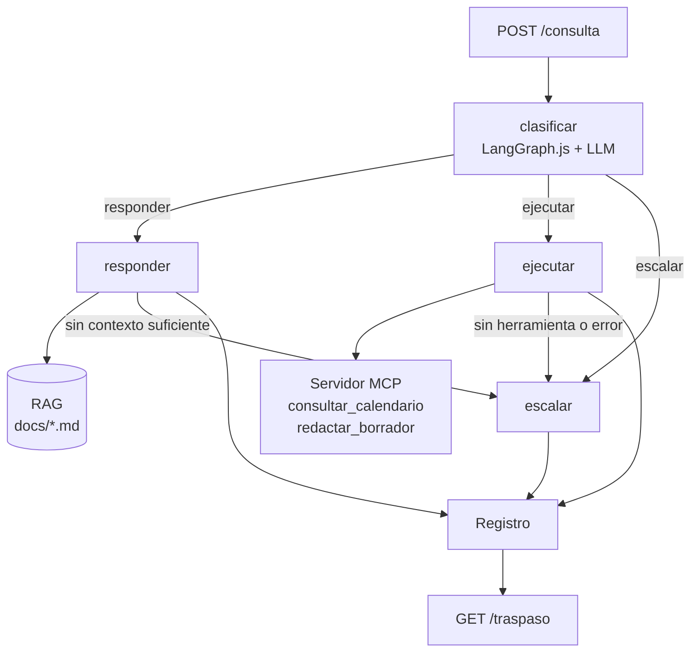

# ai-day-challenge

**Suplente digital para tareas de rutina** | Un bot entrenado con el conocimiento de una persona o equipo que responde las dudas frecuentes o cubre tareas puntuales cuando esa persona no está disponible (vacaciones, licencia).

Challenge nivel **Practitioner** — charla *"Construyendo agentes: orquestadores, MCP y RAG"*.

## Qué hace

| Capacidad | Cómo |
|---|---|
| **Responder** dudas frecuentes | RAG sobre la base de conocimiento en `docs/` |
| **Ejecutar** tareas puntuales | Servidor MCP propio (calendario y borradores de mensajes) |
| **Escalar** lo que no debe resolver solo | Aprobaciones, temas sensibles, consultas sin contexto o tareas que fallan quedan como pendientes |
| **Traspasar** al volver la persona | Resumen de lo atendido y lista de pendientes |

## Arquitectura



- **Orquestador** (`src/graph.ts`): un `StateGraph` de LangGraph.js con los nodos `classify`, `respond`, `execute` y `escalate`. Cada consulta queda registrada una sola vez en `src/log.ts`.
- **RAG** (`src/rag/`):
  - Al arrancar, fragmenta los `.md` de `docs/` en partes de 500 caracteres con 80 de solapamiento.
  - Los embeddings se generan localmente con `Xenova/multilingual-e5-small` (Transformers.js), así que no hacen falta API key ni hay límites de uso.
  - Los vectores se guardan en un vector store en memoria.
- **MCP** (`src/mcp/`):
  - Servidor stdio propio (`suplente-tools`), que el servidor principal levanta como subproceso.
  - Se conecta con `@langchain/mcp-adapters`, que permite sumar más servidores MCP en `src/mcp/client.ts`.
  - El nodo `execute` hace tool calling con hasta 3 iteraciones.
- **Traspaso** (`src/handoff.ts`):
  - Cuenta las consultas por ruta y lista los pendientes.
  - Pide al modelo un resumen breve. Si el modelo no está disponible, usa un resumen fijo.

### Límites del suplente

- Responde **solo** con información de la base de conocimiento. Hay dos controles:
  - **Umbral de similitud:** si el mejor fragmento puntúa menos de 0.83, la consulta se escala.
  - **Validación del modelo:** si el modelo indica que el contexto no alcanza, la consulta se escala.
- Escala aprobaciones, sueldos, RR. HH., salud, temas legales, incidentes de seguridad, accesos a producción y decisiones de presupuesto (ver `docs/criterios-de-escalado.md`).
- Los borradores **no se envían**: quedan marcados como `[BORRADOR - NO ENVIADO]`.

## Stack

Node.js + TypeScript (ESM) · Express · LangGraph.js · LangChain.js · `@modelcontextprotocol/server` · Transformers.js · OpenRouter (modelo gratuito).

## Cómo levantarlo

Requisitos: Node.js 20.10+ (probado con 24) y una API key de [OpenRouter](https://openrouter.ai/settings/keys).

```bash
npm install
cp .env.example .env   # completar las variables
npm run dev
```

Variables de entorno:

```
PORT=3000
OPENROUTER_API_KEY=sk-or-v1-...
OPENROUTER_MODEL=nvidia/nemotron-3-super-120b-a12b:free
```

El modelo tiene que soportar **tool calling**. Se probó con `nvidia/nemotron-3-super-120b-a12b:free`. Los modelos `:free` tienen límites de pedidos por minuto y por día.

El primer arranque descarga el modelo de embeddings, que tarda alrededor de un minuto. Los siguientes arranques tardan unos segundos.

## Endpoints

| Método | Ruta | Descripción |
|---|---|---|
| `GET` | `/health` | Estado del servidor |
| `POST` | `/consulta` | Body `{ "pregunta": "..." }` → `{ respuesta, ruta, escalada }` |
| `GET` | `/traspaso` | `{ total, respondidas, ejecutadas, escaladas, resumen, pendientes }` |
| `GET` | `/buscar?q=...` | Debug: fragmentos del RAG con su puntaje |

## Ejemplos

```bash
# responder
curl -X POST localhost:3000/consulta -H "Content-Type: application/json" \
  -d '{"pregunta": "¿Cómo pido un reintegro de gastos?"}'

# ejecutar (consultar_calendario)
curl -X POST localhost:3000/consulta -H "Content-Type: application/json" \
  -d '{"pregunta": "¿Qué reuniones hay mañana?"}'

# ejecutar (redactar_borrador)
curl -X POST localhost:3000/consulta -H "Content-Type: application/json" \
  -d '{"pregunta": "Redactá un mail para Laura avisando que la revisión del sprint se pasa al jueves"}'

# escalar
curl -X POST localhost:3000/consulta -H "Content-Type: application/json" \
  -d '{"pregunta": "¿Me aprobás un aumento de sueldo?"}'

# traspaso
curl localhost:3000/traspaso
```

En Windows con Git Bash, los acentos pueden llegar mal si el body va inline. En ese caso conviene enviarlo desde un archivo UTF-8 con `--data-binary @consulta.json`.

## Estructura

```
src/
├── server.ts        # Express y rutas
├── llm.ts           # modelo vía OpenRouter
├── graph.ts         # orquestador LangGraph.js
├── handoff.ts       # resumen de traspaso
├── log.ts           # registro de interacciones (en memoria)
├── rag/             # embeddings, ingesta y búsqueda
└── mcp/             # servidor MCP propio y cliente
docs/                # base de conocimiento (inventada)
```

## Limitaciones conocidas

- El registro y el vector store viven en memoria, así que se pierden al reiniciar el servidor.
- Los eventos del calendario son simulados.
- El umbral de relevancia (0.83) se calibró con pocas consultas.
