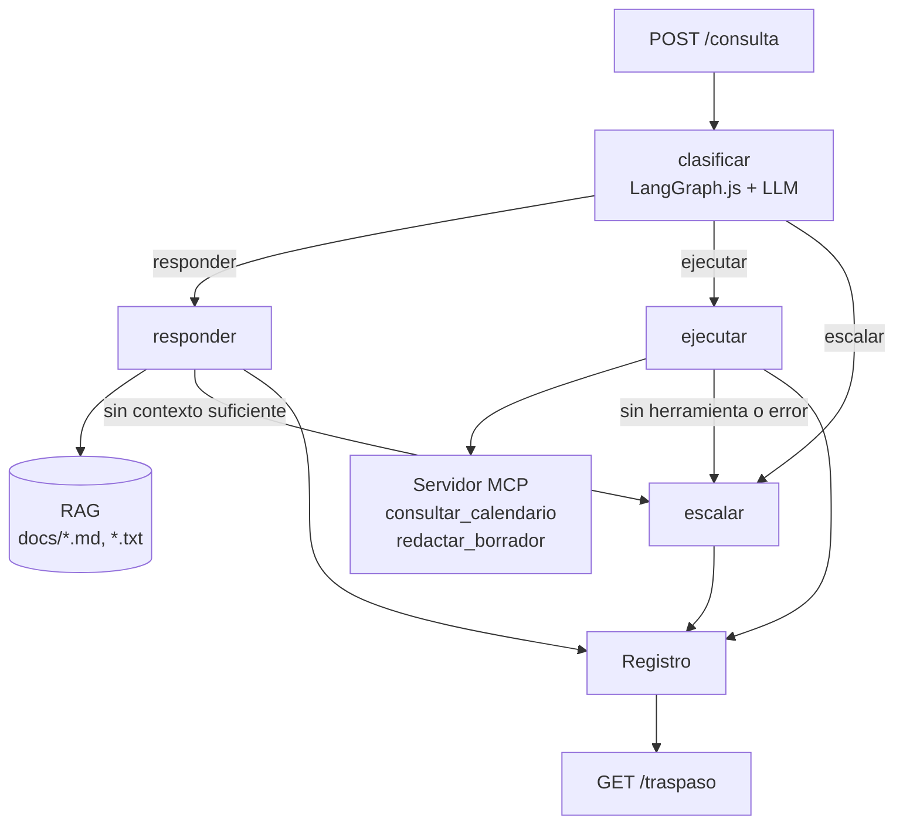

# ai-day-challenge

**Suplente digital para tareas de rutina** | Un bot que cubre a una persona o equipo cuando no está disponible (vacaciones, licencia): responde dudas frecuentes consultando su base de conocimiento, ejecuta tareas puntuales con herramientas, escala lo que no debe resolver solo y, al volver la persona, le entrega un resumen de lo atendido.

El proyecto tiene dos partes:

- **`back/`**: la API del suplente (orquestador, RAG, MCP y traspaso).
- **`front/`**: una interfaz web para conversar con el suplente y probar cada ruta.

Challenge nivel **Practitioner** — charla *"Construyendo agentes: orquestadores, MCP y RAG"*.

## Qué hace

| Capacidad | Cómo |
|---|---|
| **Responder** dudas frecuentes | RAG sobre la base de conocimiento en `docs/` |
| **Ejecutar** tareas puntuales | Servidor MCP propio (calendario y borradores de mensajes) |
| **Escalar** lo que no debe resolver solo | Aprobaciones, temas sensibles, consultas sin contexto o tareas que fallan quedan como pendientes |
| **Traspasar** al volver la persona | Resumen de lo atendido y lista de pendientes |

## Arquitectura



Las rutas de esta sección son relativas a `back/`.

- **Orquestador** (`src/graph.ts`): un `StateGraph` de LangGraph.js con los nodos `classify`, `respond`, `execute` y `escalate`. Cada consulta queda registrada una sola vez en `src/log.ts`.
- **RAG** (`src/rag/`):
  - Al arrancar, fragmenta los `.md` y `.txt` de `docs/` en partes de 500 caracteres con 80 de solapamiento.
  - Los embeddings se generan localmente con `Xenova/multilingual-e5-small` (Transformers.js), así que no hacen falta API key ni hay límites de uso.
  - Los vectores se guardan en un vector store en memoria.
- **MCP** (`src/mcp/`):
  - Servidor stdio propio (`suplente-tools`), que el servidor principal levanta como subproceso.
  - Se conecta con `@langchain/mcp-adapters`, que permite sumar más servidores MCP en `src/mcp/client.ts`. `suplente-tools` es obligatorio; si un servidor adicional falla al conectar, se omite con una advertencia y el back sigue funcionando.
  - El nodo `execute` hace tool calling con hasta 4 iteraciones. El prompt describe solo las herramientas cargadas y los resultados se recortan a 6000 caracteres.
- **Traspaso** (`src/handoff.ts`):
  - Cuenta las consultas por ruta y lista los pendientes.
  - Pide al modelo un resumen breve. Si el modelo no está disponible, usa un resumen fijo.

### Límites del suplente

- Responde **solo** con información de la base de conocimiento. Hay dos controles:
  - **Umbral de similitud:** si el mejor fragmento puntúa menos de 0.83, la consulta se escala.
  - **Validación del modelo:** si el modelo indica que el contexto no alcanza, la consulta se escala.
- Escala aprobaciones, sueldos, RR. HH., salud, temas legales, incidentes de seguridad, accesos a producción y decisiones de presupuesto (ver `docs/criterios-de-escalado.md`).
- Los borradores **no se envían**: quedan marcados como `[BORRADOR - NO ENVIADO]`.

## Stack

- **Back:** Node.js + TypeScript (ESM) · Express · LangGraph.js · LangChain.js · `@modelcontextprotocol/server` · Transformers.js · LLM vía API compatible con OpenAI (Google AI Studio u OpenRouter).
- **Front:** Next.js (App Router) · React · TypeScript · CSS Modules.

## Cómo levantarlo

Requisitos: Node.js 20.10+ (probado con 24) y una API key de [Anthropic (Claude)](https://platform.claude.com) o de un proveedor compatible con la API de OpenAI, por ejemplo [Google AI Studio](https://aistudio.google.com/apikey) u [OpenRouter](https://openrouter.ai/settings/keys).

```bash
cd back
npm install
cp .env.example .env   # completar las variables
npm run dev
```

Variables de entorno:

```
PORT=3000

# Google AI Studio (Gemini)
LLM_BASE_URL=https://generativelanguage.googleapis.com/v1beta/openai/
LLM_API_KEY=AIza...
LLM_MODEL=gemini-flash-latest
```

Para usar **Claude**, definí `LLM_PROVIDER=anthropic`:

```
LLM_PROVIDER=anthropic
ANTHROPIC_API_KEY=sk-ant-...
# LLM_MODEL=claude-opus-5-5   (opcional, es el valor por defecto)
```

Con Claude se usa `ChatAnthropic` (SDK oficial de Anthropic) con el *fallback* del lado del servidor activado. Es un servicio pago, sin cupo gratuito diario.

Si `LLM_BASE_URL` no está definida, se usa OpenRouter (`https://openrouter.ai/api/v1`). Por compatibilidad, `OPENROUTER_API_KEY` y `OPENROUTER_MODEL` se usan cuando no hay `LLM_API_KEY` ni `LLM_MODEL`.

El modelo tiene que soportar **tool calling**. Se probó con `gemini-flash-latest` (Google AI Studio) y con `nvidia/nemotron-3-super-120b-a12b:free` (OpenRouter). Los planes gratuitos tienen límites de pedidos por minuto y por día.

El primer arranque descarga el modelo de embeddings, que tarda alrededor de un minuto. Los siguientes arranques tardan unos segundos.

### Front

Con el back corriendo, en otra terminal:

```bash
cd front
npm install
npm run dev   # http://localhost:3001
```

El front llama a `/api/*` y Next.js lo reenvía al back (`http://localhost:3000` por defecto, configurable con `BACKEND_URL`), así que no hace falta habilitar CORS. La pantalla tiene:

- **Chat** con el suplente: cada respuesta indica su ruta (`responder`, `ejecutar` o `escalar`) y si quedó escalada. Incluye preguntas de ejemplo para probar cada ruta.
- **Suplente de guardia**: tarjeta con la persona que está cubriendo.
- **Traspaso**: genera el resumen con contadores por ruta y la lista de pendientes.
- **Estado del back**: indicador en el encabezado.

## Endpoints

| Método | Ruta | Descripción |
|---|---|---|
| `GET` | `/health` | Estado del servidor |
| `POST` | `/consulta` | Body `{ "pregunta": "..." }` → `{ respuesta, ruta, escalada }` |
| `GET` | `/traspaso` | `{ total, respondidas, ejecutadas, escaladas, resumen, pendientes }` |
| `GET` | `/buscar?q=...` | Debug: fragmentos del RAG con su puntaje |

## Ejemplos

```bash
# responder
curl -X POST localhost:3000/consulta -H "Content-Type: application/json" \
  -d '{"pregunta": "¿Cómo pido un reintegro de gastos?"}'

# ejecutar (consultar_calendario)
curl -X POST localhost:3000/consulta -H "Content-Type: application/json" \
  -d '{"pregunta": "¿Qué reuniones hay mañana?"}'

# ejecutar (redactar_borrador)
curl -X POST localhost:3000/consulta -H "Content-Type: application/json" \
  -d '{"pregunta": "Redactá un mail para Laura avisando que la revisión del sprint se pasa al jueves"}'

# escalar
curl -X POST localhost:3000/consulta -H "Content-Type: application/json" \
  -d '{"pregunta": "¿Me aprobás un aumento de sueldo?"}'

# traspaso
curl localhost:3000/traspaso
```

En Windows con Git Bash, los acentos pueden llegar mal si el body va inline. En ese caso conviene enviarlo desde un archivo UTF-8 con `--data-binary @consulta.json`.

## Tests

Ambas apps tienen tests automáticos con Vitest, deterministas y sin red: el LLM, el modelo de embeddings y el backend se simulan.

```bash
cd back && npm test    # grafo, API, traspaso, RAG, herramientas MCP
cd front && npm test   # cliente de API y componentes
```

La estrategia y la lista de escenarios (Dado/Cuando/Entonces) están en [TESTING.md](TESTING.md).

## Estructura

```
back/                    # API (Node.js + TypeScript)
├── src/
│   ├── app.ts           # Express y rutas
│   ├── server.ts        # arranque (RAG, MCP, listen)
│   ├── llm.ts           # modelo (proveedor compatible con OpenAI)
│   ├── graph.ts         # orquestador LangGraph.js
│   ├── handoff.ts       # resumen de traspaso
│   ├── log.ts           # registro de interacciones (en memoria)
│   ├── rag/             # embeddings, ingesta y búsqueda
│   └── mcp/             # servidor MCP propio, lógica de herramientas y cliente
├── test/                # tests (Vitest)
└── docs/                # base de conocimiento (inventada)
front/                   # interfaz web (Next.js)
└── src/
    ├── app/             # página y estilos globales
    ├── components/      # chat, traspaso, suplente de guardia, encabezado
    └── lib/api.ts       # llamadas al back
```

## Posibles evolutivos

**Integraciones reales (nuevos servidores MCP)**

- **Microsoft 365 / Teams:** consultar la disponibilidad de la persona, agendar reuniones de Teams y buscar contactos vía Microsoft Graph. Requiere una app registrada en Entra ID con consentimiento del tenant y login por *device code*, nunca con usuario y contraseña.
- **Slack:** leer los canales del equipo (por ejemplo, `#rrhh` o `#anuncios`) para responder con contexto reciente, con un servidor MCP propio de solo lectura y una lista de canales permitidos. A futuro, avisar en un canal cada vez que se escala una consulta.

**Herramientas actuales**

- **Calendario:** consultar por rango de fechas ("esta semana") en lugar de un solo día.
- **Borradores:** guardarlos para que aparezcan en el traspaso y la persona pueda revisarlos al volver; usar las plantillas de `docs/plantillas-de-respuesta.md` según el tipo de mensaje.

**RAG**

- **Documentos largos:** fragmentar por sección o artículo (por ejemplo, una ley) y recuperar más fragmentos, para que las respuestas no queden incompletas.
- **Ingesta sin reiniciar:** un endpoint o un proceso que detecte documentos nuevos y los indexe en caliente.
- **Persistencia:** un vector store persistente (por ejemplo, SQLite con extensión vectorial) para no recalcular los embeddings en cada arranque.

**Calidad y operación**

- **Evaluación:** un set de preguntas de evaluación por ruta, contra el LLM real, para calibrar el umbral de relevancia (los tests automáticos actuales simulan el LLM).
- **Registro persistente:** guardar las interacciones en una base de datos para que el traspaso sobreviva a los reinicios.
- **Usuarios y permisos:** identificar quién consulta y restringir lo que el suplente puede responder o ejecutar según el rol.
- **Deploy:** publicar el back y el front con las claves como variables de entorno de la plataforma.

## Limitaciones conocidas

- El registro y el vector store viven en memoria, así que se pierden al reiniciar el servidor.
- Los eventos del calendario son simulados.
- El umbral de relevancia (0.83) se calibró con pocas consultas.
- Con planes gratuitos del LLM hay límites diarios y demoras puntuales; si se agota el cupo, las consultas fallan hasta que se reinicie o se cambie de proveedor.
